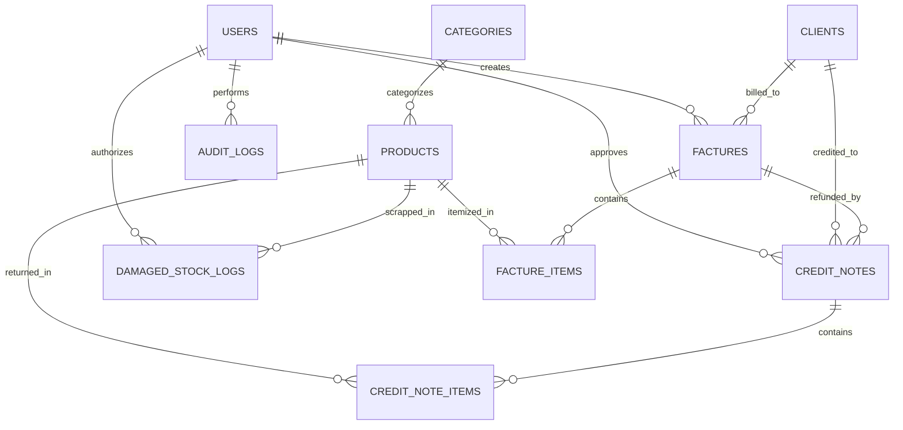

<div align="center">

# ⚡ FactureFlow

### Enterprise-Grade Inventory, POS & Facture (Invoice) Management Platform

[](https://nextjs.org/)
[](https://www.typescriptlang.org/)
[](https://tailwindcss.com/)
[](https://www.prisma.io/)
[](https://github.com/pmndrs/zustand)
[](LICENSE)

<p align="center">
  A modern, high-performance SaaS platform inspired by Linear, Stripe, and Vercel for real-time inventory tracking, barcode point-of-sale (POS), official A4 invoicing, 80mm thermal receipt printing, credit notes (<i>Avoir</i>), and year-over-year (YoY) financial analytics.
</p>

[Key Features](#-key-features) • [Tech Stack](#-tech-stack) • [Quick Start](#-quick-start) • [RBAC & Demo Credentials](#-rbac--demo-credentials) • [Database Schema](#-database-schema) • [API Reference](#-api-reference)

</div>

---

## 🌟 Key Features

### 🛒 1. High-Speed POS & Facture Billing Engine
* **Split-View Interface:** Category tabs, live product search, and responsive catalog grid on the left; real-time reactive order cart on the right.
* **Barcode Scanner Support:** Camera stream barcode scanner, USB hardware scanner listener, and simulation presets.
* **Stock Safety Guard:** Real-time inventory validation preventing cart quantities from exceeding sellable stock (`quantity_sellable`).
* **Tax & Discount Engine:** Line-item and global cart discounts with automated 20% TVA calculations.
* **Dual Output Engine:** One-click clean **A4 Printable Invoices** (official B2B with tax ID/ICE) and **80mm Thermal Receipts** (retail counters) via `@media print`.

### 📦 2. Product & Inventory Management
* **Smart Stock Badges:** Dynamic visual indicators (🟢 In Stock, 🟠 Low Stock, 🔴 Out of Stock).
* **Inline Quick Adjusters:** Quick `+1`, `+5`, `-1`, `-5` stock modifier buttons bound to automatic audit logging.
* **Client-Side WebP Image Compressor:** HTML5 `<canvas>` compressor reducing product images below $< 200\text{ KB}$ with live compression statistics.
* **Stock Alert Center:** Compiles items requiring immediate supplier reorders.

### 🔄 3. Returns, Credit Notes (*Avoir*) & Damaged Goods
* **Credit Notes (*Avoir*):** Process returns tied directly to original invoice IDs (`AVR-2024-XXXX`).
* **Smart Stock Routing:** Route returned goods to **Sellable Stock** (`quantity_sellable + N`) or **Damaged Pool** (`quantity_damaged + N`).
* **Damaged Goods Write-Off Engine:** Deduct broken or expired inventory and compute net financial losses ($\text{Quantity} \times \text{Unit Cost}$) isolated from standard sales P&L.

### 📈 4. Financial Valuation & YoY Historical Snapshots
* **Valuation Overview:** Real-time metrics for Total Inventory Cost ($\sum \text{Qty} \times \text{Cost}$), Total Retail Valuation ($\sum \text{Qty} \times \text{Price}$), and Unrealized Margin %.
* **Automated Midnight Snapshots:** Captures end-of-day stock counts and valuations into `daily_stock_snapshots`.
* **YoY Growth Engine:** Compare stock levels, sales velocity, and total valuation against the exact same calendar date last year.

### 🛡️ 5. Role-Based Access Control (RBAC) & Audit Trail
* **Granular Security Tiers:** Admin, Manager, and Cashier roles with dynamic privilege switches.
* **Manager Price Override System:** Sleek 4-digit PIN authorization modal when cashiers attempt custom discounts or price overrides.
* **Immutable Audit Trail:** Real-time tracking of `PRICE_OVERRIDE`, `APPROVE_RETURN`, `EDIT_PRODUCT_COST`, `WRITE_OFF_DAMAGED`, `CREATE_FACTURE`, capturing actor ID, timestamp, IP address, and JSON diffs of `old_values` vs `new_values`.

---

## 🛠️ Tech Stack

| Domain | Technology |
|---|---|
| **Framework** | [Next.js 14 (App Router)](https://nextjs.org/) |
| **Language** | [TypeScript](https://www.typescriptlang.org/) |
| **Styling** | [Tailwind CSS](https://tailwindcss.com/) with Dark/Light mode |
| **Icons & UI** | [Lucide React](https://lucide.dev/), [Canvas Confetti](https://www.npmjs.com/package/canvas-confetti) |
| **State Management** | [Zustand](https://github.com/pmndrs/zustand) |
| **Charts & Analytics** | [Recharts](https://recharts.org/) |
| **Database & ORM** | [Prisma ORM](https://www.prisma.io/) (PostgreSQL & SQLite compatible) |
| **Image Processing** | HTML5 `<canvas>` WebP client-side compressor |
| **Document Output** | Custom CSS `@media print` engine for A4 & 80mm thermal printers |

---

## 🚀 Quick Start

### Prerequisites
- [Node.js](https://nodejs.org/) (v18.0.0 or higher)
- `npm` or `yarn` / `pnpm`

### Installation

```bash
# 1. Clone the repository
git clone https://github.com/SouL-Dev-exe/Facture_Flow.git
cd Facture_Flow

# 2. Install dependencies
npm install

# 3. Setup environment variables
cp .env.example .env

# 4. Generate Prisma Client & Initialize Database
npx prisma generate
npx prisma db push

# 5. Start the development server
npm run dev
```

Open [http://localhost:3000](http://localhost:3000) in your browser.

---

## 🛡️ RBAC & Demo Credentials

Use the top-right role switcher or test the PIN authorization modals using the pre-configured credentials:

| Role | Permissions | Demo PIN | Default User |
|---|---|---|---|
| **Admin** | Full system write access, financial valuation, manual snapshot trigger, overrides | `1234` | Sarah Connor |
| **Manager** | Quick stock modification (+1/+5/-1/-5), return/credit note approvals, damaged write-offs, cashier price overrides | `9999` | Alex Vance |
| **Cashier** | Strictly restricted to POS billing and barcode checkout. Price changes and returns trigger Manager PIN modal | `0000` | John Doe |

---

## 🗄️ Database Schema

The application implements an enterprise relational schema:



---

## 📡 API Reference

| Method | Endpoint | Description |
|---|---|---|
| `GET` / `POST` | `/api/products` | List products or create a new catalog item |
| `PATCH` | `/api/products` | Quick stock adjuster (+1, +5, -1, -5) or price/cost edit with audit log |
| `GET` / `POST` | `/api/factures` | List invoices or checkout a POS order with stock deduction |
| `GET` / `POST` | `/api/credit-notes` | List or issue an official Credit Note (*Avoir*) with stock routing |
| `GET` / `POST` | `/api/damaged-stock` | Retrieve write-off logs or scrap damaged inventory |
| `GET` | `/api/analytics` | Financial valuation, revenue metrics, and YoY summary |
| `GET` / `POST` | `/api/snapshots` | List daily snapshots or trigger midnight valuation snapshot |
| `GET` | `/api/audit-logs` | Query immutable audit logs with before/after JSON snapshots |
| `POST` | `/api/auth/verify-pin` | Verify Manager / Admin PIN code for privileged actions |

---

## ⌨️ Keyboard Shortcuts

* `Cmd+K` / `Ctrl+K` — Open global Command Palette to jump to any page or search products.
* `Esc` — Close active modals and dialogs.

---

## 🤝 Contributing

Contributions are welcome! Please follow these steps:
1. Fork the repository.
2. Create your feature branch (`git checkout -b feature/amazing-feature`).
3. Commit your changes (`git commit -m 'Add some amazing feature'`).
4. Push to the branch (`git push origin feature/amazing-feature`).
5. Open a Pull Request.

---

## 📄 License

This project is licensed under the MIT License - see the [LICENSE](LICENSE) file for details.

---

<div align="center">
  <sub>Built with ❤️ by the FactureFlow Engineering Team.</sub>
</div>
